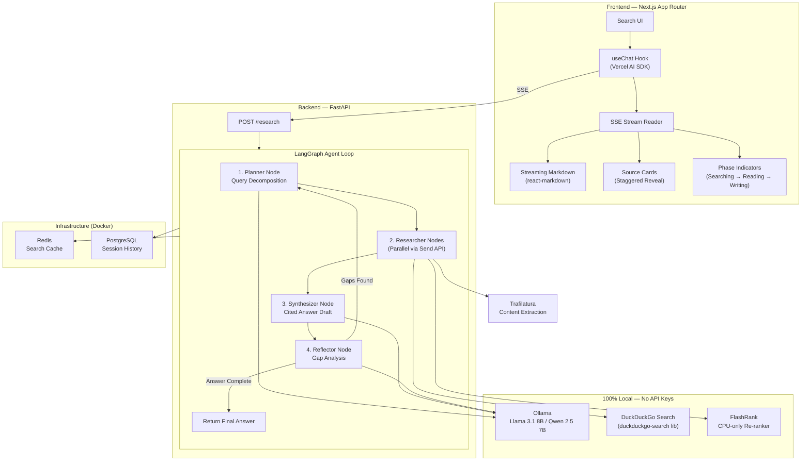
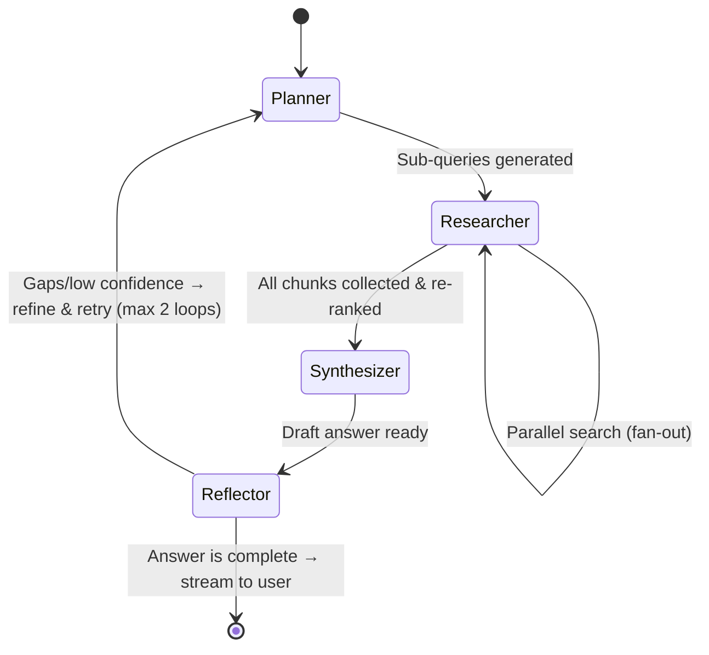

# AI Research Agent — Architecture & Implementation Plan

An autonomous research agent that decomposes complex questions, searches the web in parallel, ranks and synthesizes evidence, and delivers cited answers with confidence — all with a premium, Perplexity-inspired UI.

> [!TIP]
> **$0 Budget Build** — This entire project runs locally with zero paid APIs, zero API keys. Just Docker + Ollama on your machine.

## System Architecture



---

## The Agentic Loop — How It Actually Works

This is the core intellectual engine. Each node is a step in a LangGraph state machine:



### Step-by-Step Flow:

| Step | Node | What Happens | LLM Call? |
|------|------|-------------|-----------|
| 1 | **Planner** | Takes user query → generates 2-4 focused sub-questions using structured output | ✅ Yes |
| 2 | **Researcher** (×N parallel) | For each sub-question: search via DuckDuckGo → scrape top 3 pages via Trafilatura → chunk text → re-rank chunks via FlashRank | ❌ No |
| 3 | **Synthesizer** | Receives top-ranked chunks from all sub-queries → generates a cited markdown answer with `[1]`, `[2]` markers | ✅ Yes (streaming) |
| 4 | **Reflector** | Evaluates the draft: Are all sub-questions answered? Any hallucinated claims without sources? Confidence score? | ✅ Yes |
| 5 | **Loop or Return** | If confidence < threshold OR gaps found → loop back to Planner with refined queries (max 2 loops). Otherwise → return final answer | — |

### Shared State Object (LangGraph `TypedDict`):
```python
class ResearchState(TypedDict):
    query: str                          # Original user question
    sub_queries: list[str]              # Decomposed sub-questions
    search_results: Annotated[list[SearchResult], add]  # Accumulated results
    ranked_chunks: list[RankedChunk]    # Re-ranked evidence
    draft_answer: str                   # Current synthesized answer
    citations: list[Citation]           # Source metadata
    reflection: ReflectionResult        # Gap analysis output
    iteration: int                      # Loop counter (max 2)
    phase: str                          # Current phase for UI status
```

---

## Tech Stack — 100% Free, Zero API Keys

| Layer | Technology | Cost | Rationale |
|-------|-----------|------|----------|
| **Frontend** | Next.js 15 (App Router) | Free | SSR, API routes, streaming support, industry standard |
| **Styling** | Vanilla CSS with CSS custom properties | Free | Full control, no framework lock-in, premium design system |
| **AI Streaming** | Vercel AI SDK (`ai` package) | Free | `useChat` hook, handles SSE, error states, stop/retry |
| **Markdown** | `react-markdown` + throttled updates | Free | Streaming-safe with 50ms update batching |
| **Animations** | Motion (Framer Motion) | Free | Spring-based, `AnimatePresence`, stagger support |
| **State** | Zustand | Free | Lightweight, perfect for research session state |
| **Backend** | FastAPI (Python) | Free | Async-native, SSE support, Pydantic validation |
| **Agent Framework** | LangGraph | Free | State machine graphs, parallel fan-out via `Send`, checkpointing |
| **LLM** | **Ollama** (Llama 3.1 8B / Qwen 2.5 7B) | Free | Runs 100% locally, no API key, supports structured output |
| **Web Search** | **`duckduckgo-search`** Python library | Free | No API key, no rate limits, returns titles + URLs + snippets |
| **Content Extraction** | Trafilatura | Free | Gold-standard text extraction, zero selectors needed |
| **Re-ranking** | **FlashRank** | Free | CPU-only, ultra-lightweight, pip install, no model download hassle |
| **Cache** | Redis (Docker) | Free | Search result caching, deduplication |
| **Database** | PostgreSQL (Docker) | Free | Research session history, user queries |
| **Containerization** | Docker Compose | Free | One-command setup for the entire stack |

> [!NOTE]
> **Ollama model recommendations by hardware:**
> - **16GB+ RAM**: `llama3.1:8b` (best quality) or `qwen2.5:7b` (fast, great structured output)
> - **8GB RAM**: `llama3.2:3b` or `phi3:mini` (lighter, still capable)
> - **GPU available**: Any of the above will run significantly faster with CUDA/ROCm

---

## Project Structure

```
ai-research-agent/
├── backend/
│   ├── app/
│   │   ├── main.py                    # FastAPI app, CORS, SSE endpoints
│   │   ├── config.py                  # Environment config (API keys, model params)
│   │   │
│   │   ├── agents/
│   │   │   ├── graph.py               # LangGraph definition (nodes + edges)
│   │   │   ├── state.py               # ResearchState TypedDict
│   │   │   ├── planner.py             # Query decomposition node
│   │   │   ├── researcher.py          # Search + scrape + chunk node
│   │   │   ├── synthesizer.py         # Answer generation node (streaming)
│   │   │   └── reflector.py           # Gap analysis + loop decision node
│   │   │
│   │   ├── services/
│   │   │   ├── llm.py                 # Ollama client wrapper (local LLM)
│   │   │   ├── search.py              # DuckDuckGo search via duckduckgo-search
│   │   │   ├── scraper.py             # Trafilatura extraction pipeline
│   │   │   ├── reranker.py            # FlashRank CPU re-ranker
│   │   │   └── cache.py               # Redis caching layer
│   │   │
│   │   ├── models/
│   │   │   ├── schemas.py             # Pydantic request/response models
│   │   │   └── database.py            # SQLAlchemy models (sessions, queries)
│   │   │
│   │   └── utils/
│   │       ├── chunker.py             # Text chunking (recursive character splitter)
│   │       └── citations.py           # Citation extraction and formatting
│   │
│   ├── requirements.txt
│   ├── Dockerfile
│   └── .env.example
│
├── frontend/
│   ├── src/
│   │   ├── app/
│   │   │   ├── layout.js              # Root layout, fonts, theme provider
│   │   │   ├── page.js                # Home page (hero search bar)
│   │   │   └── research/
│   │   │       └── page.js            # Research results page
│   │   │
│   │   ├── components/
│   │   │   ├── SearchBar.js           # Animated search input
│   │   │   ├── SourceCards.js         # Horizontal source strip with favicons
│   │   │   ├── StreamingAnswer.js     # Markdown renderer with inline citations
│   │   │   ├── CitationTooltip.js     # Hover tooltip for [1], [2] markers
│   │   │   ├── PhaseIndicator.js      # "Searching..." → "Reading..." → "Writing..."
│   │   │   ├── FollowUpChips.js       # Suggested follow-up questions
│   │   │   ├── SkeletonLoader.js      # Shimmer loading state
│   │   │   └── ThemeToggle.js         # Dark/light mode switch
│   │   │
│   │   ├── hooks/
│   │   │   └── useResearch.js         # Custom hook wrapping useChat + phase tracking
│   │   │
│   │   ├── stores/
│   │   │   └── researchStore.js       # Zustand store for session state
│   │   │
│   │   └── styles/
│   │       └── globals.css            # Design system: tokens, animations, components
│   │
│   ├── package.json
│   └── Dockerfile
│
├── docker-compose.yml                 # Full stack: frontend + backend + redis + postgres
├── .env.example                       # All required API keys
└── README.md                          # Architecture diagram, demo video, setup guide
```

---

## API Contract

### `POST /api/research` — Start a Research Session

**Request:**
```json
{
  "query": "What are the latest breakthroughs in quantum error correction and how close are we to fault-tolerant quantum computing?",
  "max_iterations": 2
}
```

**Response (SSE stream):**

The server streams events in this sequence:
```
event: phase
data: {"phase": "planning", "message": "Breaking down your question..."}

event: sub_queries
data: {"queries": ["latest quantum error correction breakthroughs 2025-2026", "fault-tolerant quantum computing timeline", "current quantum error rates vs threshold"]}

event: phase
data: {"phase": "searching", "message": "Searching 3 sub-questions across the web..."}

event: sources
data: {"sources": [{"url": "https://...", "title": "...", "favicon": "...", "domain": "nature.com", "snippet": "..."}]}

event: phase
data: {"phase": "reading", "message": "Reading and analyzing 12 sources..."}

event: phase
data: {"phase": "writing", "message": "Synthesizing your answer..."}

event: token
data: {"token": "Recent"}

event: token
data: {"token": " breakthroughs"}

event: phase
data: {"phase": "reflecting", "message": "Checking for gaps..."}

event: follow_up
data: {"suggestions": ["How does Google's Willow chip compare to IBM's approach?", "What is the surface code and why does it matter?", "Which companies are closest to fault-tolerant QC?"]}

event: done
data: {"session_id": "abc123", "total_sources": 12, "iterations": 1, "confidence": 0.89}
```

### `GET /api/sessions/{session_id}` — Retrieve Past Session

Returns the full research session with answer, sources, and metadata.

### `POST /api/research/{session_id}/followup` — Follow-up Query

Continues an existing research session with additional context from prior answers.

---

## Database Schema

```sql
CREATE TABLE research_sessions (
    id UUID PRIMARY KEY DEFAULT gen_random_uuid(),
    created_at TIMESTAMP DEFAULT NOW(),
    updated_at TIMESTAMP DEFAULT NOW()
);

CREATE TABLE research_queries (
    id UUID PRIMARY KEY DEFAULT gen_random_uuid(),
    session_id UUID REFERENCES research_sessions(id),
    query TEXT NOT NULL,
    sub_queries JSONB,
    answer TEXT,
    sources JSONB,          -- Array of {url, title, domain, favicon, snippet}
    citations JSONB,        -- Array of {index, source_url, claim}
    confidence FLOAT,
    iterations INTEGER DEFAULT 1,
    follow_up_suggestions JSONB,
    created_at TIMESTAMP DEFAULT NOW()
);
```

---

## Design System — Dark Mode Color Palette

```css
:root {
    /* Indigo Night — Premium dark theme */
    --bg-primary: #0a0a0f;
    --bg-secondary: #12121a;
    --bg-tertiary: #1a1a2e;
    --bg-hover: #222236;

    --text-primary: #e4e4e7;
    --text-secondary: #a1a1aa;
    --text-tertiary: #71717a;

    --accent: #818cf8;
    --accent-hover: #6366f1;
    --accent-glow: rgba(129, 140, 248, 0.15);

    --border-subtle: rgba(255, 255, 255, 0.08);
    --border-default: rgba(255, 255, 255, 0.12);

    --success: #34d399;
    --warning: #fbbf24;
    --error: #fb7185;
}
```

**Typography:** Inter (Google Fonts) — clean, modern, excellent readability.

---

## Phased Build Plan

### Phase 0 — Environment Setup (Day 0)
> Get Ollama and Docker running on your machine.

- [ ] Install [Ollama](https://ollama.com) and pull your model: `ollama pull llama3.1:8b`
- [ ] Verify Ollama is running: `curl http://localhost:11434/api/tags`
- [ ] Install Docker Desktop (for Redis + PostgreSQL)
- [ ] Test a quick Ollama call from Python to confirm connectivity

### Phase 1 — Foundation (Days 1–3)
> Get the backend agent loop working end-to-end in the terminal.

- [ ] Project scaffolding (monorepo structure, Docker Compose skeleton)
- [ ] Backend: FastAPI app with health check endpoint
- [ ] `config.py` — environment variables (Ollama host, model name, etc.)
- [ ] `services/llm.py` — Ollama client wrapper (using `ollama` Python package or `httpx`)
- [ ] `services/search.py` — DuckDuckGo search via `duckduckgo-search` library
- [ ] `services/scraper.py` — Trafilatura extraction + `httpx` fetching
- [ ] `utils/chunker.py` — Recursive text chunker (500 chars, 50 overlap)
- [ ] `services/reranker.py` — FlashRank re-ranker setup
- [ ] `agents/state.py` — `ResearchState` TypedDict
- [ ] `agents/planner.py` — Query decomposition with structured output
- [ ] `agents/researcher.py` — Search → scrape → chunk → rerank pipeline
- [ ] `agents/synthesizer.py` — Cited answer generation
- [ ] `agents/reflector.py` — Gap analysis + loop decision
- [ ] `agents/graph.py` — LangGraph wiring (nodes, edges, conditional routing)
- [ ] Test the full loop via CLI — input a question, get a cited answer

### Phase 2 — API & Streaming (Days 4–5)
> Expose the agent as a streaming SSE API.

- [ ] `POST /api/research` — SSE endpoint wrapping the LangGraph agent
- [ ] Stream phase updates, sources, tokens, and follow-ups as separate SSE events
- [ ] Redis caching layer for search results (avoid duplicate DuckDuckGo calls)
- [ ] PostgreSQL setup — session & query persistence
- [ ] `GET /api/sessions/{id}` — retrieve past sessions
- [ ] `POST /api/research/{id}/followup` — follow-up queries
- [ ] Error handling — graceful fallbacks for search failures, Ollama timeouts

### Phase 3 — Frontend (Days 6–9)
> Build the premium Perplexity-inspired UI.

- [ ] Next.js project setup (App Router)
- [ ] Design system — `globals.css` with all CSS custom properties, animations
- [ ] `SearchBar.js` — Hero search bar with glow animation on focus
- [ ] `PhaseIndicator.js` — Animated status transitions
- [ ] `SkeletonLoader.js` — Shimmer loading state
- [ ] `SourceCards.js` — Horizontal strip with staggered reveal
- [ ] `StreamingAnswer.js` — Markdown rendering with throttled updates
- [ ] `CitationTooltip.js` — Hover tooltips on `[1]`, `[2]` markers
- [ ] `FollowUpChips.js` — Suggested follow-up pill buttons
- [ ] `useResearch.js` — Custom hook for SSE consumption + phase tracking
- [ ] Home page — hero layout with search bar + recent searches
- [ ] Research results page — full results layout
- [ ] Dark/light mode toggle with `next-themes`
- [ ] Responsive design (mobile-first)

### Phase 4 — Polish & Ship (Days 10–12)
> Make it portfolio-ready.

- [ ] Architecture diagram in README (Mermaid or Excalidraw)
- [ ] Record a 90-second demo video (Loom — free)
- [ ] Docker Compose — one-command full-stack startup (`docker compose up`)
- [ ] `.env.example` documenting config options (model name, ports — no API keys!)
- [ ] Error boundaries and loading states for all edge cases
- [ ] Performance pass — debounce inputs, cache static assets
- [ ] SEO meta tags on all pages
- [ ] Final UX polish — transitions, hover effects, micro-interactions
- [ ] GitHub README with: architecture diagram, demo video, setup instructions, screenshots

---

## User Review Required

> [!IMPORTANT]
> **Styling Approach** — The plan uses **vanilla CSS** with custom properties for the design system. The research referenced Tailwind/Shadcn since that's what most open-source clones use — but we're going vanilla for maximum control and learning. Confirm this is what you want.

> [!TIP]
> **Zero API Keys** — This project uses NO paid services. Everything runs locally: Ollama for LLM, DuckDuckGo for search, FlashRank for re-ranking, Docker for Redis/Postgres.

## Open Questions

1. **Which Ollama model?** `llama3.1:8b` (best quality, needs 16GB RAM) vs `llama3.2:3b` (lighter, works on 8GB). What's your machine's RAM/GPU situation?
2. **Do you want user authentication?** Or keep it open/anonymous for the portfolio demo?
3. **TypeScript or JavaScript** for the frontend? TypeScript is more impressive on a resume but adds setup time.
4. **GitHub hosting only?** Or do you want a way to deploy a live demo too (e.g., a friend's server, a free VPS trial)?

---

## Verification Plan

### Automated Tests
- Unit tests for each agent node (planner, researcher, synthesizer, reflector) with mocked LLM responses
- Integration test: full agent loop with a sample query → verify cited output
- API test: SSE endpoint streams correct event sequence
- Frontend: verify streaming render doesn't flicker, citations are clickable

### Manual Verification
- End-to-end demo: submit a complex multi-faceted question and verify the agent loops, searches, and synthesizes correctly
- Test with edge cases: single-word queries, very long queries, queries with no good search results
- Mobile responsiveness check
- Dark/light mode toggle verification
- Record demo video as final validation
